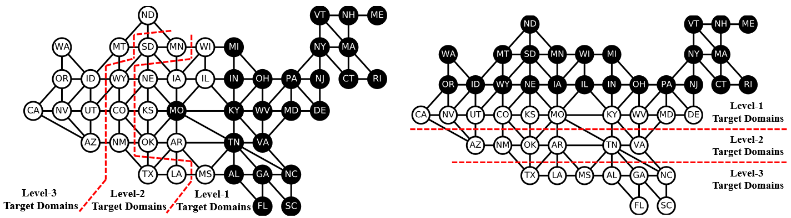
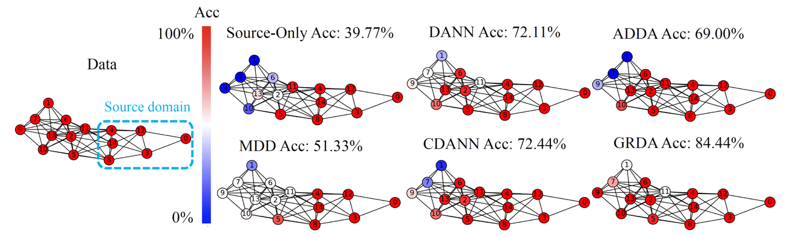
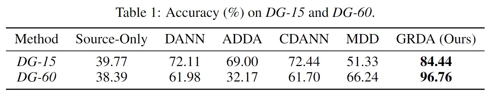
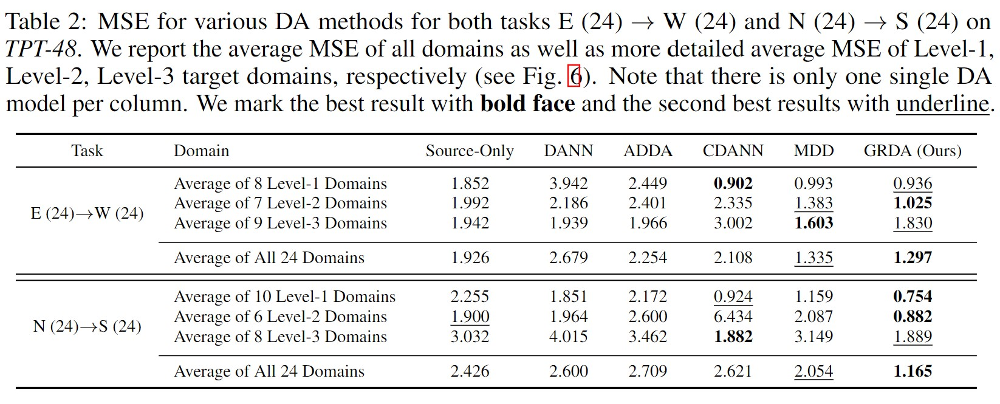
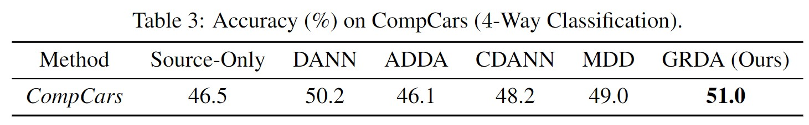

# Graph-Relational Domain Adaptation (GRDA)
This repo contains the code for our ICLR 2022 paper:<br>
**Graph-Relational Domain Adaptation**<br>
Zihao Xu, Hao He, Guang-He Lee, Yuyang Wang, Hao Wang<br>
*Tenth International Conference on Learning Representations (ICLR), 2022*<br>
[[Paper](http://wanghao.in/paper/ICLR22_GRDA.pdf)] [[Talk](https://www.youtube.com/watch?v=oNM5hZGVv34)] [[Slides](http://wanghao.in/slides/GRDA_slides.pptx)]


## Beyond Domain Adaptation: Brief Introduction for GRDA
Essentially GRDA goes beyond current (categorical) domain adaptation regime and proposes the first approach to **adapt across graph-relational domains**. We introduce a new notion, dubbed "**domain graph**", that to encode domain adjacency, e.g., a graph of states in the US with each state as a domain and each edge indicating adjacency. Theoretical analysis shows that *at equilibrium, GRDA recovers classic domain adaptation when the graph is a clique, and achieves non-trivial alignment for other types of graphs*. See the following example (black nodes as source domains and white nodes as target domains).

<p align="center">

</p>

## Sample Results
In a DA problem with 15 domains connected by a domain graph (see the figure below), if we use domains 0, 3, 4, 8, 12, 14 as source domains (left of the following figure) and the rest as target domains, below are some sample results from previous domain adaptation methods and GRDA (right of the figure), where GRDA successfully generalizes across different domains in the graph.

<p align="center">

</p>

## Method Overview
We provide a simple yet effective learning framework with **theoretical guarantees** (see the [Theory section](https://github.com/Wang-ML-Lab/GRDA/edit/main/README.md#theory-informal) at the end of this README). Below is a quick comparison between previous domain adaptation methods and GRDA (differences marked in red). 
* Previous domain adaptation methods use a discriminator is classifify different domains (as categorical values), while GRDA's discriminator directly reconstructs the domain graph (as a adjacency matrix).
* Previous domain adaptation methods' encoders ignore domain IDs, while GRDA takes the domain IDs with the domain graph as input.
<p align="center">

</p>

## Quantitative Result
#### Toy Dataset: DG-15 and DG-60
<p align="center">

</p>

#### TPT-48
<p align="center">

</p>

#### CompCars
<p align="center">

</p>

## Theory (Informal)
- Traditional DA is equivalent to using our GRDA with a fully-connected graph (i.e., a clique).
- D and E converge if and only if 𝔼<sub>i\~p(u|e),j\~p(u|e')</sub>[A<sub>i,j</sub>|e, e'] = 𝔼<sub>i,j</sub>[A<sub>i,j</sub>].
- The global optimum of the two-player game between E and D matches the three-player game between E, D, and F.

<!--  -->

## Installation
    pip install -r requirements.txt

## How to Train GRDA
    python main.py

## Visualization
We use visdom to visualize. We assume the code is run on a remote gpu machine.

### Change Configurations
Find the config in "config" folder. Choose the config you need and Set "opt.use_visdom" to "True".

### Start a Visdom Server on Your Machine
    python -m visdom.server -p 2000
Now connect your computer with the gpu server and forward the port 2000 to your local computer. You can now go to:
    http://localhost:2000 (Your local address)
to see the visualization during training.

## Also Check Out Relevant Work
**Continuously Indexed Domain Adaptation**<br>
Hao Wang*, Hao He*, Dina Katabi<br>
*Thirty-Seventh International Conference on Machine Learning (ICML), 2020*<br>
[[Paper](http://wanghao.in/paper/ICML20_CIDA.pdf)] [[Code](https://github.com/hehaodele/CIDA)] [[Talk](https://www.youtube.com/watch?v=KtZPSCD-WhQ)] [[Blog](http://wanghao.in/CIDA-Blog/CIDA.html)] [[Slides](http://wanghao.in/slides/CIDA_slides.pptx)]

## Reference
[Graph-Relational Domain Adaptation](http://wanghao.in/paper/ICLR22_GRDA.pdf)
```bib
@inproceedings{GRDA,
  title={Graph-Relational Domain Adaptation},
  author={Xu, Zihao and He, Hao and Lee, Guang-He and Wang, Yuyang and Wang, Hao},
  booktitle={International Conference on Learning Representations},
  year={2022}
}
```
